# Sistemas mecanicos 
Un sistema mecánico es un conjunto de componentes interrelacionados que interactúan entre sí para realizar un trabajo físico, a través de la conversión de energía mecánica. Para este caso se abordaron dos sistemas elementales cuyos elementos principales son el resorte y el amortiguador. El análisis de estos sistemas se llevan de acuerdo a las ecuaciones que los describen, es decir la ley de Hooke y la  fricción viscosa , una vez determinada la interpretación, cualquier sistema propuesto se soluciona  inicialmente empleando un diagrama de cuerpo libre donde se describen como interactúan las fuerzas según la convención seleccionada, una vez realizado este proceso se plantea un análisis escrito donde de acuerdo al diagrama de cuerpo libre, se describe a través de una ecuación diferencial  las fuerzas que intervienen en el sistema. Para finalizar el análisis se plantea la solución mediante la transformada de Laplace donde al graficar su solución es posible visualizar el comportamiento de las masas del sistema al aplicar una fuerza.
## 1. Principio general de modelamiento
El principio general del modelamiento en dinámica de sistemas consiste en representar el comportamiento dinámico de un sistema físico mediante ecuaciones matemáticas, aplicando leyes fundamentales de la física. Su objetivo es predecir y entender cómo responde el sistema ante diversas entradas o condiciones, para todos los sistemas en general describe que la energia de entrada es distribuida a lo largo del sistema, lo que describe lo sigueiente.

$$\text{Tasa de acumulación} \, \frac{\text{Masa}}{\text{Energía}} = \text{Flujo de} \, \frac{\text{Masa}}{\text{Energía}} \, \text{Entrada} - \text{Flujo de} \, \frac{\text{Masa}}{\text{Energía}} \, \text{Salida}$$

## 2. Diagrama de cuerpo libre 
>🔑 Un diagrama de cuerpo libre (DCL) es una representación gráfica utilizada en la física e ingeniería para mostrar todas las fuerzas y momentos que actúan sobre un objeto o cuerpo, de manera aislada de su entorno. Es una herramienta fundamental para analizar el equilibrio y el movimiento de un cuerpo dentro de un sistema mecánico, y se utiliza principalmente en la resolución de problemas de estática y dinámica.

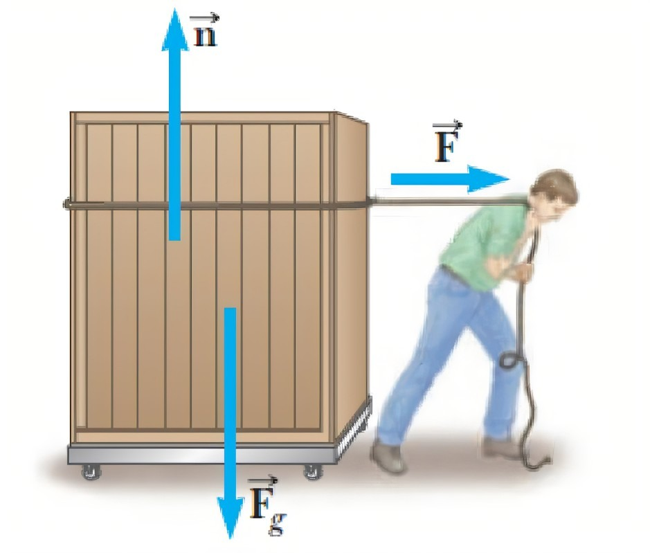

## 3. Fricción
>🔑La fricción es una fuerza resistiva que se genera cuando dos superficies entran en contacto y tienden a deslizarse o moverse una sobre la otra. Esta fuerza actúa en dirección opuesta al movimiento relativo de las superficies involucradas y puede dificultar o frenar el movimiento. La fricción es el resultado de las interacciones microscópicas entre las irregularidades de las superficies en contacto.Existen varios tipos de fricción, dependiendo de la naturaleza de las superficies y del movimiento relativo entre ellas.
### 3.1 Fricción estática
Es la fricción que impide que dos objetos comiencen a deslizarse uno sobre otro. Es la fuerza que se opone al inicio del movimiento. La fricción estática es generalmente mayor que la fricción cinética.
### 3.2 Fricción por deslizamiento  
Es la fricción que actúa cuando dos superficies ya están en movimiento relativo. Una vez que el objeto empieza a deslizarse, la fricción que se genera es la fricción cinética, que generalmente es menor que la fricción estática.
### 3.3 Fricción por rodamiento 
Ocurre cuando un objeto rueda sobre una superficie en lugar de deslizarse. La fricción de rodadura es generalmente mucho menor que la fricción de deslizamiento
## 4. Sistema masa resorte 
Un sistema masa-resorte es un modelo físico que describe el comportamiento de un objeto (la masa) conectado a un resorte. Este sistema es uno de los más fundamentales y estudiados en la física, especialmente en el estudio de la dinámica de sistemas oscilatorios. La interacción entre la masa y el resorte da lugar a un movimiento oscilatorio, conocido como movimiento armónico simple (MAS), bajo ciertas condiciones.

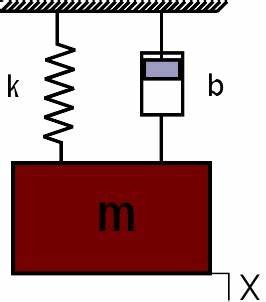

### 4.1 Resorte
>🔑Un resorte es un componente que almacena energía potencial cuando se deforma, es decir, cuando se estira o se comprime. Es un sistema mecánico que puede oscilar o moverse bajo la influencia de fuerzas, como la fuerza de restitución que genera el propio resorte debido a su deformación.
### 4.1.1 Ley de Hooke
La Ley de Hooke aplicada a los resortes describe cómo la fuerza que ejerce un resorte es proporcional a la deformación que sufre (ya sea por estiramiento o compresión). Es una relación fundamental que se utiliza para modelar el comportamiento de los resortes en sistemas dinámicos.

💡**Ejemplo 1:** sistema masa resorte

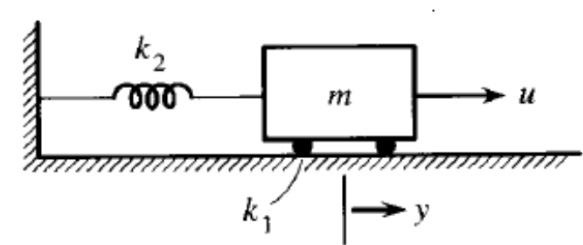

$$ \ F_R = K_2 \cdot y(t)\ $$
$$ \ u - F_R - F_F = m \cdot a\ $$
$$ \ u(t) - K_2 \cdot y(t) - K_1 \cdot \dot{y}(t) = m \cdot \ddot{y}(t)\ $$

## 5. Sistema masa amortiguador
En este sistema, la masa (m) está unida a un resorte con constante elástica  k y a un amortiguador (que puede ser representado como un pistón o un fluido viscoso). La fuerza de amortiguamiento se representa comúnmente como una fuerza proporcional a la velocidad del objeto, es decir, una fuerza de fricción viscosa.
### 5.1 Amortiguador 
>🔑Un amortiguador es un dispositivo mecánico utilizado para reducir o controlar las oscilaciones y absorber impactos o vibraciones en sistemas dinámicos. Su función principal es disipar la energía de los movimientos oscilatorios o de choque, convirtiéndola generalmente en calor, lo que ayuda a estabilizar y suavizar el movimiento de un objeto o estructura Generación de fricción: En un amortiguador por fricción, dos partes del sistema (como discos, zapatas o bloques) se mueven en contacto unas con otras. Cuando el sistema se mueve, la fricción entre estas superficies resiste el movimiento.
Conversión de energía: A medida que las superficies friccionan entre sí, la energía cinética del movimiento se convierte en calor, lo que reduce la velocidad del objeto en movimiento.
Desaceleración: El calor generado por la fricción disipa la energía de manera controlada, evitando oscilaciones excesivas o movimientos bruscos. La velocidad del sistema disminuye de forma progresiva hasta que se detiene o alcanza una velocidad constante deseada.
### 5.1.1 Fricción viscosa
Es una fuerza resistiva que depende de la velocidad relativa entre las superficies en contacto. En el contexto de un sistema de amortiguación, como un amortiguador de vehículo, la fricción viscosa se modela generalmente como una fuerza proporcional a la velocidad del objeto en movimiento.

💡**Ejemplo 2:** sistema masa amortiguador 

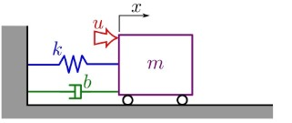

$$\ F_F = b \cdot \dot{y}(t)\ $$
$$\ u - F_R - F_F = m \cdot a\ $$
$$\ u(t) - k \cdot y(t) - b \cdot \dot{y}(t) = m \cdot \ddot{y}(t)\ $$

## 6. Sistema masa resorte amortiguador
Un sistema masa-resorte-amortiguador es un sistema físico comúnmente utilizado para modelar oscilaciones amortiguadas. Este sistema consta de una masa m, un resorte con constante elástica 𝑘, y un amortiguador con coeficiente de fricción 𝑏.

💡**Ejemplo 3:** Planteamiento de ecuaciones para un sistema masa resorte amortigua 

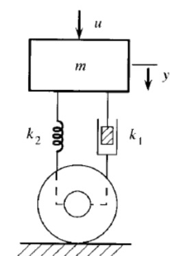

$$ \sum F = m \cdot a\$$
$$ \ u + F_W - F_R - F_F = m \cdot a\$$
$$ \ u(t) + F_W - K_2 \cdot y(t) - K_1 \cdot \dot{y}(t) = m \cdot \ddot{y}(t)\$$

💡**Ejemplo 4:** Planteamiento de ecuaciones para un sistema con dos masas resorte amortiguador 

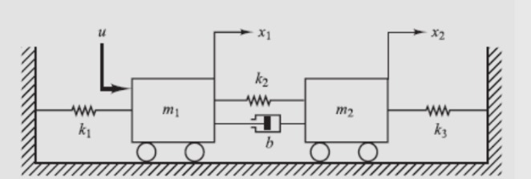

 - Ecuación para la masa 1

$$ \ u - F_{R1} - F_{R2} - F_F = m \cdot a\$$

$$ \ u(t) - K_1 \cdot y(t) - K_2 \cdot (y_1(t) - y_2(t)) - b \cdot (\dot{y}_1(t) - \dot{y}_2(t)) = m \cdot \ddot{y}(t)\$$

 - Ecuación para la masa 2

$$ \ F_{R2} - F_{R3} + F_F = m \cdot a \$$
$$ \ K_2 \cdot (y_1(t) - y_2(t)) - K_3 \cdot y(t) + b \cdot (\dot{y}_1(t) - \dot{y}_2(t)) = m \cdot \ddot{y}(t) \$$

- Modelo
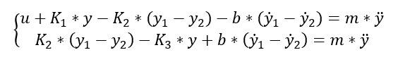

💡**Ejemplo 5:** Solucion propuesta para un sistema masa resorte amortigua 

 
 - Ecuación para la masa 1

$$\ F_{R2} + F_W - F_B - F_{R1} = m_1 \cdot a_1\$$

$$\ K_2 \cdot (y_1 - y_2) + F_W - b \cdot \dot{y} - K_1 \cdot y = m \cdot \ddot{y}(t)\$$

 - Ecuación para la masa 2

$$\ u + F_W - F_{R2} = m_2 \cdot a_2 \$$

$$\ u + F_W - K_2 \cdot (y_2 - y_1) = m_2 \cdot \ddot{y}(t) \$$

## 7. Ejercicios
### 📚Ejercicio 1

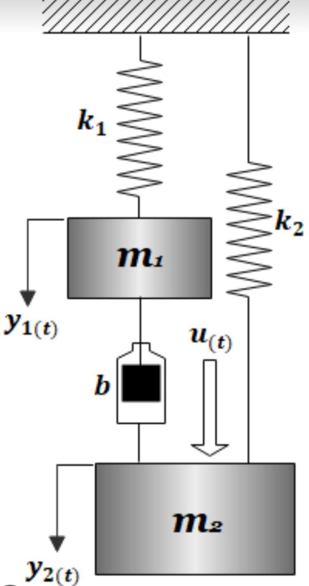

$$ F_B - F_{k1} + F_w = m_1 a_1 $$
$$ b(\dot{y}_1 - \dot{y}_2) - K_1 y_1 + F_w = m_1 \ddot{y}_1 $$

$$ u - F_B + F_w - F_{R2} = m_2 a_2 $$
$$ u + b(\dot{y}_2 - \dot{y}_1) + F_w - K_2(y_2 - y_1) = m_2 \ddot{y}_2$$

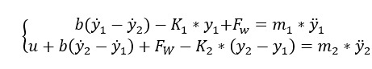

### 📚Ejercicio 2

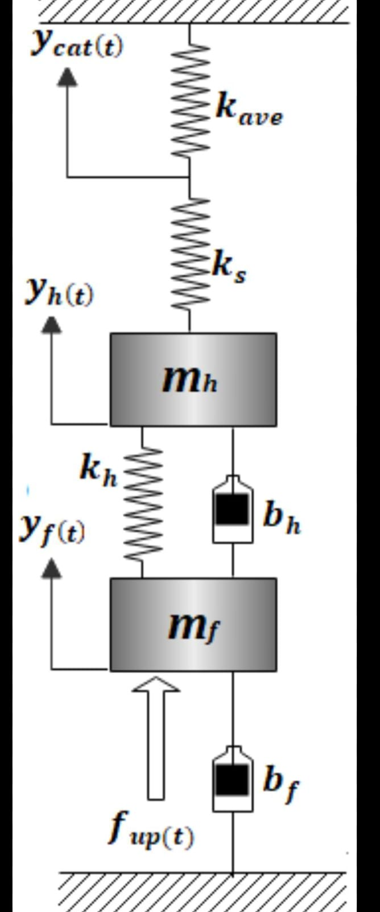

$$ F_B + F_{kh} + F_{ks} = m_h a_h $$

$$ m_h y ̈_h+b_h y ̇_h+y_h (K_ave+K_s+K_h )-b_h y ̇_f-y_f (K_s+K_h )=0$$

$$F_kh+F_bf-F_bh-F_up=m_f a_f$$

$$m_f y ̈_f+b_f y ̇_f-y_h (K_s+K_h )+〖(b〗_h 〖+b〗_f)y ̇_f+y_f (K_s+K_h )=f_up  $$

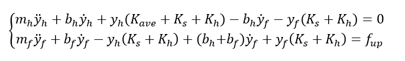

## 8. Conclusiones

Modelar sistemas masa-resorte-amortiguador permite describe el comportamiento de masas de acuerdo. Además tener un modelo en función de una salida permitirá analizar y graficar el cambio de posición de cada masa según se varía el valor de entrada. Los modelos dinámicos son fundamental para analizar vibraciones mecánicas, diseñar sistemas de control, estudiar estabilidad y entender la transmisión de fuerzas en los sistemas mecánicas.

## 9. Bibliografia 

[ChatGPT] (https://openai.com/chatgpt)

[Lidefer] (https://fjferrer.webs.ull.es/Apuntes3/Leccion01/15_dinmica_de_los_sistemas_mecanicos.html)
