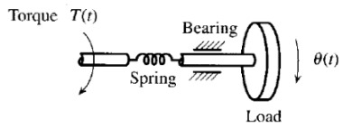
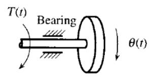
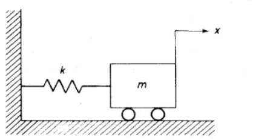
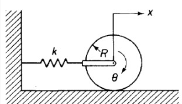
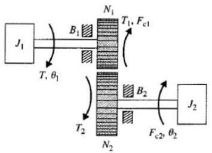
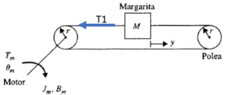

# Modelación de sistemas mecánicos
Un sistema rotacional es un sistema físico en el que las variables principales del movimiento están asociadas a la rotación de cuerpos rígidos alrededor de un eje, a diferencia de los desplazamientos lineales. En un sistema rotacional se lleva a cabo el análisis a través de la fuerza de rozamiento descrita por el Angulo de torsión, la fuerza de fricción de acuerdo con la velocidad angular y el torque (variable de entrada) como producto del momento de inercia. 
Existen dos formas elementales de analizar sistemas mecánicos, la ya mencionada funciona mediante de las leyes de newton, sin embargo, existe una alternativa que se propone mediante el análisis del trabajo, energía y potencia generado por los componentes habituales tales como los resortes y los amortiguadores. Como ultimo recurso se presento los sistemas combinados que se pueden presentar de manera habitual   y la manera en que se lleva a cabo el análisis de estos.
## 1. Sistemas rotacionales 
Los sistemas mecánicos rotacionales son aquellos donde el movimiento se produce mediante rotación en lugar de traslación por lo que se habla de torques en vez de fuerzas. por lo que a analisar un sistema rotacional se involucran torques, momentos de inercia, velocidades angulares y aceleraciones angulares.

### 1.1 Fuerza de rozamiento 
>🔑 La fuerza de rozamiento también llamada fricción rotacional es una fuerza resistiva que se opone al movimiento angular de un cuerpo. Esta fuerza genera un torque de fricción que actúa en sentido contrario al de la rotación, provocando una pérdida de energía mecánica (generalmente en forma de calor), y contribuyendo a la disipación de energía en el sistema.
 
$$ F_R = k \cdot \varphi$$

### 1.2 Fuerza de fricción 
>🔑 Es una fuerza resistiva que se opone al movimiento angular de un cuerpo giratorio. Esta fricción se manifiesta como un torque de freno o resistencia que actúa en sentido contrario a la rotación, y su función principal es disipar energía mecánica, generalmente transformándola en calor. La fricción rotacional es responsable de que los cuerpos giratorios eventualmente se detengan si no se aplica un torque externo.

$$ F_F = b \cdot \frac{d\varphi}{dt}$$

### 1.3 Torque 
>🔑El torque también llamado momento de fuerza es la medida de la fuerza que causa un giro o rotación sobre un cuerpo respecto a un eje. En sistemas rotacionales, el torque es la fuerza angular neta que genera aceleración rotacional, cumpliendo un papel análogo a la fuerza en los sistemas traslacionales.

$$ T = J \cdot \frac{d^2\varphi}{dt^2}$$

💡**Ejemplo 1:** Modelo para un sistema rotacional 

$$ T - F_R - F_F = J \cdot \alpha $$
$$T(t) - k \cdot \theta(t) - b \cdot \frac{d\theta(t)}{dt} = J \cdot \frac{d^2\theta(t)}{dt^2}$$ 

💡**Ejemplo 2:** sistema rotacionales 

$$ T(t) - F_F = J \cdot \alpha $$
$$T(t) - b \cdot \frac{d\theta(t)}{dt} = J \cdot \frac{d^2\theta(t)}{dt^2}$$ 

## 2 Modelo a partir del análisis del trabajo, la energía y potencia
### 2.1  Trabajo
es una medida de la energía transferida a un sistema por medio de una fuerza (o torque) aplicada a lo largo de un desplazamiento (lineal o angular). Representa el proceso por el cual una fuerza o torque realiza una acción sobre un cuerpo, cambiando su estado de energía.
### 2.2 Energía 
La energía es una de las ideas centrales en la dinámica de sistemas, ya que permite analizar el comportamiento de un sistema sin tener que resolver directamente las ecuaciones de movimiento
#### 2.2.1 Energía potencial 
Es la energía almacenada debido a la posición o deformación

$$ U = \int_{0}^{h} mg \, dx = mgh $$

#### 2.2.2 Energía cinética 
Es la energía del movimiento

$$ T = \frac{1}{2}mv^2 \quad \text{y} \quad T = \frac{1}{2}J\dot{\theta}^2 $$
$$ \Delta T = \frac{1}{2} J \dot{\theta}_2^2 - \frac{1}{2} J \dot{\theta}_1^2 $$

### 2.3 Potencia
Es la velocidad con la que se transfiere energía mecánica a través de fuerza y movimiento (traslacional o rotacional).
### 2.4 Energía potencial en un resorte 
La energía potencial en un resorte representa la energía almacenada cuando el resorte se deforma, estira o comprime. Esta energía se puede transformar en energía cinética, energía disipada  o volver a almacenarse si el sistema oscila.
### 2.5 Potencia de un resorte 
Es la energía almacenada cuando el resorte se comprime o se estira desde su posición natural de equilibrio, esta energía puede luego liberarse para realizar trabajo sobre otros cuerpos.
### 2.6 Potencia en una masa
Es la tasa de cambio de energía mecánica (principalmente cinética) de la masa, o la potencia entregada o absorbida por una fuerza que actúa sobre ella.
### 2.7 Energía disipada por un amortiguador 
Es la energía mecánica transformada en calor debido a la resistencia al movimiento que introduce el amortiguador.
Un amortiguador no almacena energía, solo disipa.
### 2.8 Potencia disipada en un amortiguador 
La potencia disipada por un amortiguador es la cantidad de energía mecánica por unidad de tiempo que el amortiguador absorbe del sistema y transforma en calor debido a la resistencia al movimiento. 

## 3 Método de energía para obtener las ecuaciones de movimiento 
### 3.1 Conservación de energía 
La conservación de la energía en dinámica de sistemas es el principio que establece que la energía total de un sistema se mantiene constante en el tiempo, siempre que no existan fuerzas disipativas (como fricción o amortiguadores). En estos casos, la energía puede transformarse entre sus diferentes formas —energía cinética y energía potencial—, pero no se pierde ni se gana energía en el proceso.
### 3.2 Sistema conservativo 
un sistema conservativo es aquel en el que la energía mecánica total se conserva a lo largo del tiempo, es decir, no se pierde ni se disipa. La energía se transforma únicamente entre sus distintas formas (cinética y potencial), sin que intervengan fuerzas disipativas como el rozamiento, la fricción o los amortiguadores.

💡**Ejemplo 3:** sistema masa resorte

$$U_0 = mgx_0 + \frac{1}{2} k \delta^2$$
$$\begin{align*}
U = mg(x_0 - x) + \frac{1}{2} k (\delta + x)^2 \\
U= mgx_0 - mgx + \frac{1}{2} k (\delta^2 + 2\delta x + x^2) \\
U= mgx_0 - mgx + \frac{1}{2} k \delta^2 + k \delta x + \frac{1}{2} kx^2 \\
U= mgx_0 + \frac{1}{2} k \delta^2 - (mg - k \delta)x + \frac{1}{2} kx^2
\end{align*}$$
$$U = U_0 + \frac{1}{2} kx^2$$

💡**Ejemplo 5:** sistema rotacionales 

$$J = \frac{1}{2} mR^2$$
$$x = R\theta$$
$$T + U = \frac{1}{2} m\dot{x}^2 + \frac{1}{2} J\dot{\theta}^2 + \frac{1}{2} kx^2 $$
$$T + U = \frac{1}{2} m\dot{x}^2 + \frac{1}{2} J\dot{\theta}^2 + \frac{1}{2} kx^2 $$
$$T + U = \frac{1}{2} m\dot{x}^2 + \frac{1}{2} J\dot{\theta}^2 + \frac{1}{2} kx^2 $$
$$\frac{3}{4} m\dot{x}^2 + \frac{1}{2} kx^2 $$
$$\frac{3}{2} m\dot{x}\ddot{x} + kx\dot{x} = 0$$
$$(m\ddot{x} + \frac{2}{3} kx)\dot{x} = 0$$
$$m\ddot{x} + \frac{2}{3} kx = 0$$

## 4 Conversión movimiento traslacional rotacional 
### 4.1 Trenes de engranajes 
Un tren de engranajes es un conjunto de ruedas dentadas (engranajes) que transmiten movimiento rotacional y par (torque) entre diferentes ejes. Su principal función es modificar la velocidad angular y el torque entre componentes de un sistema mecánico, manteniendo una relación cinemática precisa entre las rotaciones de los engranajes conectados.
### 4.2 Palancas 
Una palanca es un elemento mecánico rígido que gira alrededor de un punto de apoyo fijo (fulcro) y se utiliza para transmitir fuerza y movimiento entre dos puntos. Funciona como un sistema mecánico rotacional simple que convierte un torque de entrada en un torque de salida, generalmente modificando la magnitud de la fuerza o la distancia angular a través de una relación de transmisión basada en las longitudes de sus brazos.
### 4.3 Bandas
un sistema de bandas o correas es un mecanismo utilizado para transmitir movimiento y potencia rotacional entre dos o más ejes mediante una banda flexible (generalmente de goma, cuero o material sintético) que envuelve poleas. Estos sistemas permiten modificar la velocidad angular y el torque, y son fundamentales en la conexión entre componentes rotacionales cuando no se desea contacto directo como en engranajes.

💡**Ejemplo 6:** combinacion de sistemas 

💡**Ejemplo 4:** combinacion de sistemas

$$T_m - T_1 - B_m \frac{d\theta}{dt} = J_m \frac{d^2\theta}{dt^2}$$
$$T_1 = Mr^2 \frac{d^2\theta}{dt^2}$$
$$T_m - Mr^2 \frac{d^2\theta}{dt^2} - B_m \frac{d\theta}{dt} = J_m \frac{d^2\theta}{dt^2}$$
$$\theta = \frac{y}{r}$$
$$T_m - Mr^2 \frac{d^2(y/r)}{dt^2} - B_m \frac{d(y/r)}{dt} = J_m \frac{d^2(y/r)}{dt^2}$$
$$T_m - \frac{Mr^2}{r} \frac{d^2y}{dt^2} - \frac{B_m}{r} \frac{dy}{dt} = \frac{J_m}{r} \frac{d^2y}{dt^2}$$
$$T_m - Mr \frac{d^2y}{dt^2} - \frac{B_m}{r} \frac{dy}{dt} = \frac{J_m}{r} \frac{d^2y}{dt^2}$$
