# Modelación de sistemas eléctricos 
En dinamica de sistemas,  los sistemas eléctricos son un modelo que describe cómo evolucionan variables eléctricas, como la corriente y el voltaje, en a medida que el tiempo  aumenta, estas variaaciones son genera debido a la interacción de estas variables con  componentes como resistencias, inductancias y capacitancias, que almacenan energia. Estos sistemas se representan mediante ecuaciones diferenciales que reflejan el analisis por las leyes de Kirchhoff y las relaciones de modelos predeterminados de los elementos eléctricos. 
## 1 Circuito eléctrico 
>🔑 Un circuito eléctrico es una interconexión de elementos eléctricos como resistencias, capacitores, inductores, fuentes de voltaje y corriente, que permite el flujo controlado de corriente eléctrica a través de un camino cerrado. En un circuito, las cargas eléctricas se desplazan impulsadas por una diferencia de potencial, realizando trabajo en los distintos componentes del sistema.
### 1.1 Circuito RLC
>🔑 Un circuito RLC es un tipo de circuito eléctrico que contiene tres componentes fundamentales como lo son una resistencia, un inductor y un capacitor conectados en serie o en paralelo. Estos circuitos combinan los efectos resistivos, inductivos y capacitivos, y son ampliamente utilizados para modelar sistemas eléctricos que presentan fenómenos de oscilación y amortiguamiento. El comportamiento dinámico de un circuito RLC se describe mediante ecuaciones diferenciales, donde la interacción entre los tres elementos determina la respuesta en el tiempo ante una señal de entrada. Los circuitos RLC son fundamentales en aplicaciones como filtros, sintonizadores de radiofrecuencia, y sistemas de comunicaciones.

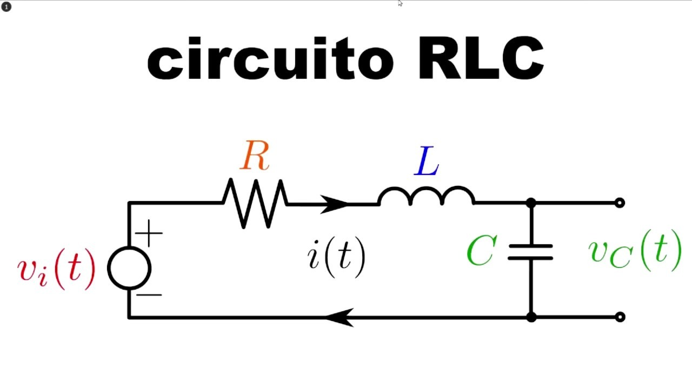

Figura 1

#### 1.1.1 Resistencia 
>🔑 La resistencia eléctrica es la magnitud física que cuantifica la oposición que presenta un material al paso de la corriente eléctrica cuando se aplica una diferencia de potencial. Se debe a las colisiones entre las los electrones y los átomos del material conductor. La resistencia se simboliza con la letra (𝑅).

$$\ R = \frac{v(t)}{i(t)} \ $$

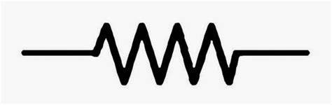

Figura 2

#### 1.1.2 Capacitor
>🔑 Un capacitor o condensador es un dispositivo eléctrico pasivo que almacena energía en forma de campo eléctrico entre dos placas conductoras separadas por un material dieléctrico. Su función principal es acumular y liberar carga eléctrica cuando es necesario. La relación entre la carga almacenada y el voltaje  en sus terminales está dada por , donde  la capacitancia, una constante que depende de las características físicas del capacitor y se mide en faradios (F). En circuitos eléctricos, los capacitores son usados para filtrar señales, suavizar voltajes y almacenar energía temporalmente.En dinámica de sistemas, un capacitor se modela como un elemento que integra el flujo de corriente para producir un voltaje. Su comportamiento dinámico está descrito la siguiente ecuación diferencial.

$$\ i(t) = C \frac{dv(t)}{dt}\ $$

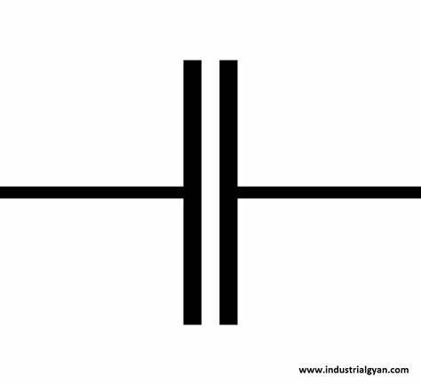

Figura 3

#### 1.1.3 Inductor 
>🔑 Un inductor es un componente eléctrico pasivo que almacena energía en un campo magnético cuando pasa corriente a través de él. Está formado típicamente por un alambre enrollado en espiral, y su principal propiedad es la inductancia, que se mide en henrios (H). La inductancia es la capacidad de un inductor para resistir cambios en la corriente eléctrica que lo atraviesa.En la dinámica de sistemas, un inductor puede representarse como un componente dentro de un sistema dinámico donde su comportamiento está gobernado por ecuaciones diferenciales. La dinámica de un sistema que involucra un inductor está relacionada con el almacenamiento de energía en un campo magnético y cómo la corriente cambia con el tiempo que se expresa de la siguiente manera.

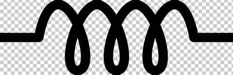
Figura 4

$$\ v(t) = L \frac{di(t)}{dt}\ $$

## 2 Analisis por mallas
El análisis por mallases una técnica en la teoría de circuitos eléctricos utilizada para determinar las corrientes en un circuito eléctrico. Este método es particularmente útil para circuitos con varias fuentes de voltaje y varios componentes conectados en mallas o lazos.
### 2.1 Malla
>🔑 Una maya es un lazo cerrado dentro del circuito, que no contiene otras mallas dentro de él. Es un camino cerrado a través del cual fluye la corriente. La maya puede estar formada por varios componentes eléctricos, como resistores, inductores, capacitores y fuentes de voltaje.

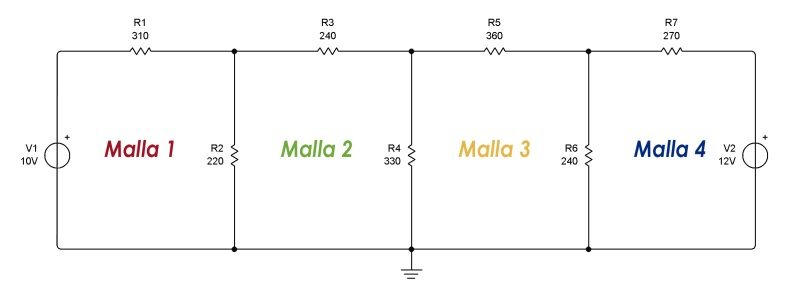
Figura 5

### 2.2 Ley de tensiones de Kirchhoff  
La Ley de Kirchhoff de tensiones es una de las leyes fundamentales en la teoría de circuitos eléctricos. Esta ley establece que la suma algebraica de todas las tensiones en una malla de un circuito es igual a cero. Es decir, la energía que se gana, a través de fuentes de voltaje debe ser igual a la energía que se pierde en resistores, inductores, capacitores, etc. la cantidad de mallas será equivalente a la cantidad de ecuaciones.

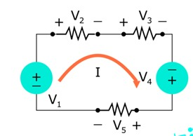

Figura 6

💡**Ejemplo 1:** sistema electrico

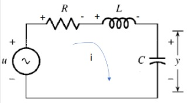

Figura 7

$$ \ -u + v_R + v_L + v_C = 0\ $$
$$ \ -u(t) + i(t) \ast R + L \frac{di(t)}{dt} + y(t) = 0\] $$
$$ \ i(t) = C \frac{dy(t)}{dt}\] $$
$$ \ -u(t) + C \frac{dy(t)}{dt} \ast R + L \frac{d}{dt} \left( C \frac{dy(t)}{dt} \right) + y(t) = 0\] $$
$$ \ -u(t) + RC \frac{dy(t)}{dt} + LC \frac{d^2 y(t)}{dt^2} + y(t) = 0\] $$

💡**Ejemplo 2:** sistema electrico 

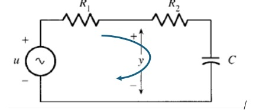

Figura 8

$$\ -u + V_{R1} + V_{R2} + V_{C} = 0\$$
$$\ -u + I(R_1 + R_2) + V_{C} = 0\$$
$$\ -I = I_C = C \frac{d(V_C)}{dt}\$$
$$\ -u + C \frac{d(V_C)}{dt} (R_1 + R_2) + V_C = 0\$$

## 3 Analisis por nodos
El análisis por nodos es un método utilizado para resolver circuitos eléctricos que se basa en la Ley de Kirchhoff de Corrientes (KCL). Este enfoque es particularmente útil cuando el circuito tiene múltiples componentes conectados en paralelo y es más sencillo trabajar con los voltajes en los nodos en lugar de las corrientes en las mallas. El análisis por nodos permite calcular los voltajes en diferentes puntos del circuito con respecto a un nodo de referencia.

### 3.1 Nodo
En el contexto de los circuitos eléctricos, un nodo es un punto de conexión en un circuito donde se encuentran dos o más componentes, como resistores, fuentes de voltaje, capacitores o inductores. En un nodo, todos los elementos conectados comparten el mismo voltaje con respecto a un nodo de referencia, comúnmente denominado tierra.

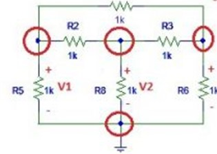

### 3.2 Ley de corrientes de Kirchhoff 
La Ley de Kirchhoff de Corrientes establece que la suma algebraica de las corrientes que entran a un nodo es igual a la suma algebraica de las corrientes que salen de ese nodo. En otras palabras, la corriente total que fluye hacia un nodo debe ser igual a la corriente total que fluye fuera de él.

$$\sum I_{\text{entrantes}} = \sum I_{\text{saliente}}$$

$$\sum I = 0\ $$

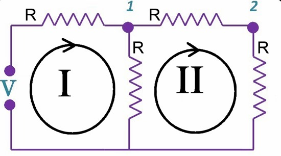

Figura 9

💡**Ejemplo 3:** sistema electrico

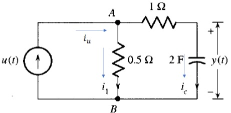

Figura 10

$$\ i_u - i_1 - i_c = 0\$$
$$\ i_u(t) - \frac{V_{AB}}{0.5} - 2\frac{dy(t)}{dt} = 0\$$
$$\ V_{AB} = i_c \ast 1 + y(t)\$$
$$\ V_{AB} = 2\frac{dy(t)}{dt} + y(t)\$$
$$\ u(t) - \frac{2}{0.5} \frac{dy(t)}{dt} - \frac{1}{0.5} y(t) - 2\frac{dy(t)}{dt} =0\$$
$$\ u(t) - 6\frac{dy(t)}{dt} - 2y(t) = 0\$$

💡**Ejemplo 4:** sistema electrico

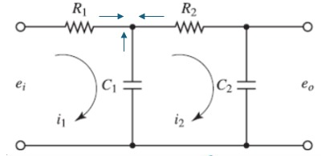

Figura 11

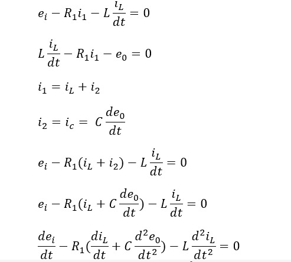

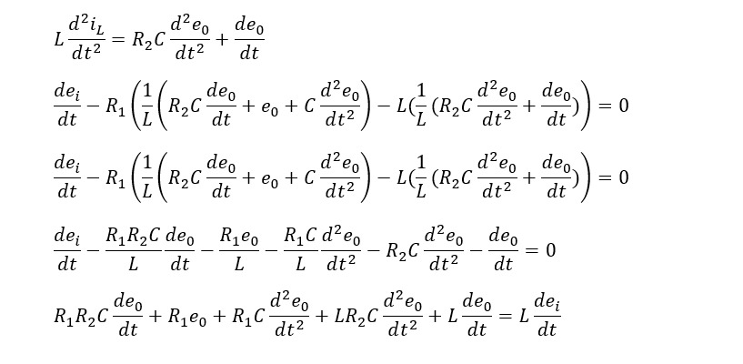

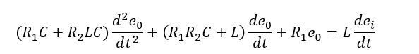

## 4 Ejercicios 
### 📚Ejercicio 1

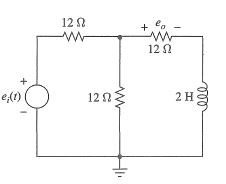

Figura 12

$$e_i(t) - 12 \, \Omega \cdot i_1(t) - v_x(t) = 0$$

$$i_1(t) = \frac{v_x(t)}{12 \, \Omega} + i_L(t)$$

$$v_x(t) - 12 \, \Omega \cdot i_L(t) - 2 \frac{di_L(t)}{dt} = 0$$

$$e_i(t) - 12 \left( \frac{v_x(t)}{12} + \frac{e_o(t)}{12} \right) - v_x(t) = 0$$

$$\left( \frac{1}{2} e_i(t) - \frac{1}{2} e_o(t) \right) - 12 \left( \frac{e_o(t)}{12} \right) - 2 \frac{d}{dt} \left( \frac{e_o(t)}{12} \right) = 0$$

$$3e_i(t) - 9e_o(t) - \frac{de_o(t)}{dt} = 0$$

### 📚Ejercicio 2

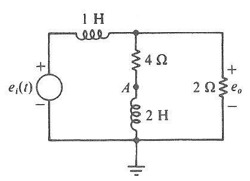

Figura 13

$$ e_i(t) = v_{L1}(t) + v_{R1}(t) = \frac{di_1(t)}{dt} + 4(i_1(t) - i_2(t))$$
$$\begin{align*}
4(2i_2(t) + i_o(t)) - 4i_2(t) &= 2\frac{di_2(t)}{dt} + 2i_o(t) \\
8i_2(t) + 4i_o(t) - 4i_2(t) &= 2\frac{di_2(t)}{dt} + 2i_o(t) \\
4i_2(t) + 2i_o(t) &= 2\frac{di_2(t)}{dt} \quad \text{(9)} \\
2i_2(t) + i_o(t) &= \frac{di_2(t)}{dt}
\end{align*}$$

$$\frac{de_i(t)}{dt} = \frac{1}{2} \frac{de_o(t)}{dt} + \frac{1}{2} \frac{d^2 e_o(t)}{dt^2} + 2 \frac{de_o(t)}{dt} \\$$

$$\frac{de_i(t)}{dt} = \frac{1}{2} \frac{d^2 e_o(t)}{dt^2} + \frac{5}{2} \frac{de_o(t)}{dt}$$

$$ 2 \frac{de_i(t)}{dt} = \frac{d^2 e_o(t)}{dt^2} + 5 \frac{de_o(t)}{dt}$$

## 5 Conclusiones 
Al analizar el comportamiento dinámico de los sistemas electricos, es posible estudiar fenómenos como respuestas transitorias, estados estacionarios, resonancia y estabilidad,ademas en muchos casos sera posible predecir algunos fallos en el sistema electrico, hecho que es importante a la diseñar y controlar de manera más eficiente.
## 6 Bibliografía 

[ChatGPT] (https://openai.com/chatgpt)

[chegg] (https://www.chegg.com/homework-help/questions-and-answers/619-circuit-shown-figure-p66-find-set-state-variable-equations-algebraic-output-equation-e-q10781615) 

