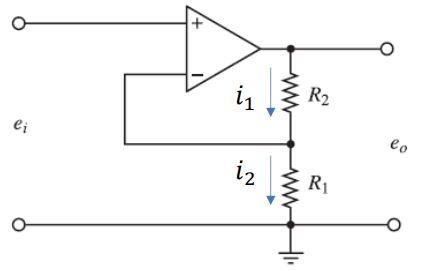
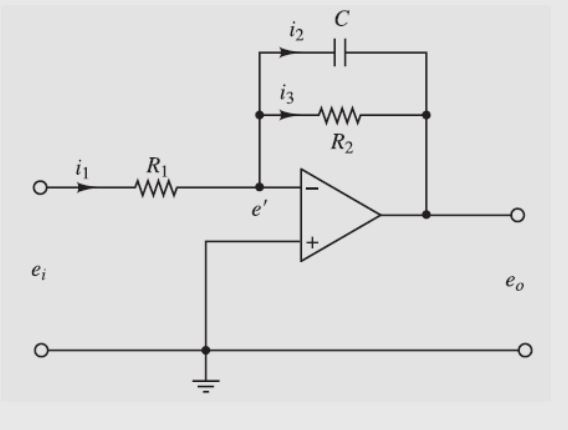
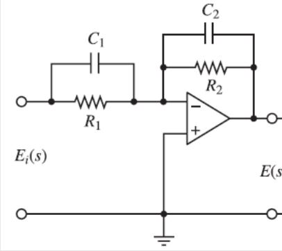
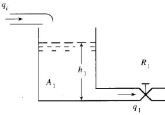
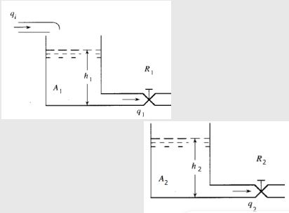
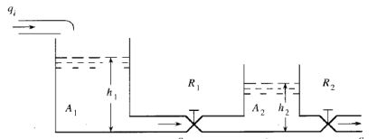
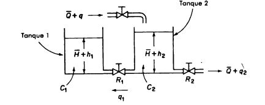

# Modelación de sistemas eléctricos e hidráulicos 
El analisis de amplificadores operacionales Permite predecir y comprender cómo los circuitos que los integran responden a señales variables en el tiempo. Esto incluye el análisis de los parámetros dinámicos esenciales para el diseño de sistemas electrónicos, este analisis es similar a los circuitos "RLC", sin embargo para este caso se asimila que la corriente en los puertos de entrada son iguales a cero ademas se establece que la salida del amplificador no se analisa pero si se determina que el voltaje en su salida es el mismo para sus entradas.
En el caso de los sistemas hidraulicos se definio son un conjunto de componentes interconectados que transmiten y controlan potencia mediante un fluido incompresible, cuyo comportamiento temporal varia deacuero a la presión, el caudal y el nivel.oara llevar a cabo este analisis se plantea inicalmente una ecuacion diferencial que describa cada uno de los tanques, y posteriormente apartir de relaciones y despejes se establece un sistema de ecuaciones o una ecuacion que describe el sistema en funcion de una variable de entrada y una de salida-

## 1 Analisis de circuitos con aimplificadores operacionales
En dinámica de sistemas, el análisis de circuitos con amplificadores operacionales se centra en modelar y entender cómo estos dispositivos controlan la relación entre señales de entrada y salida en diferentes configuraciones. Los amplificadores operacionales ideales se caracterizan por tener impedancia de entrada infinita, impedancia de salida cero y una ganancia de voltaje infinita, lo que implica que no hay corriente en las entradas y que los voltajes en las terminales  y son prácticamente iguales si existe retroalimentación negativa. El análisis consiste en aplicar estas propiedades ideales junto con las leyes de Kirchhoff y la ley de Ohm para plantear ecuaciones que describan el comportamiento dinámico del sistema. Dependiendo de su configuración, los amplificadores operacionales pueden funcionar como amplificadores inversores, no inversores, sumadores, integradores o derivadores, permitiendo la construcción de modelos matemáticos que representan ecuaciones diferenciales o relaciones algebraicas entre las señales. Así, los amplificadores operacionales se utilizan en dinámica de sistemas para modelar, analizar y diseñar sistemas de control, filtros, y otros circuitos que afectan la dinámica de señales eléctricas.
### 1.1 Amplificador no inversor 
Un amplificador operacional no inversor es una configuración de circuito que utiliza un op-amp para amplificar una señal de entrada sin invertir su fase. La señal de entrada se aplica directamente a la terminal no inversora (+), mientras que una red de retroalimentación (típicamente resistiva) conecta la salida a la terminal inversora (-). El modelo en dinámica de sistemas se centra en cómo esta retroalimentación configura una ganancia de lazo cerrado estable y una respuesta dinámica predecible, donde la salida sigue a la entrada amplificada por un factor determinado por la relación de las resistencias de retroalimentación, influyendo en la respuesta temporal y en frecuencia del sistema en el que se integra.

💡**Ejemplo 1:** amplificador operacional

$$i_1 - i_2 = 0$$
$$\frac{e_o - e_i}{R_2} - \frac{e_i}{R_1} = 0$$
$$\frac{e_o}{R_2} = e_i \left( \frac{1}{R_2} + \frac{1}{R_1} \right)$$
$$e_o = e_i \left( 1 + \frac{R_2}{R_1} \right)$$

💡**Ejemplo 2:** amplificador operacional

$$i_1 - i_2 - i_3 = 0$$

$$\frac{e_i - e'}{R_1} - \frac{e' - e_o}{R_2} - C \frac{d(e' - e_o)}{dt} = 0$$

$$\frac{e_i}{R_1} - \frac{-e_o}{R_2} - C \frac{d(-e_o)}{dt} = 0$$

$$\frac{e_i}{R_1} = -\frac{e_o}{R_2} - C \frac{d(e_o)}{dt}$$

💡**Ejemplo 3:** amplificador operacional

## 2 Analisis de sistemas hidráulicos
En dinámica de sistemas, los sistemas hidráulicos se modelan como analogías de otros tipos de sistemas físicos, como los eléctricos o los mecánicos, para entender cómo se comportan dinámicamente bajo diversas condiciones. Un sistema hidráulico es aquel en el que el movimiento o almacenamiento de un fluido (generalmente un líquido) se utiliza para transmitir, almacenar o controlar energía. En dinámica de sistemas, se estudia cómo variables como la presión, el caudal y el volumen cambian con el tiempo, basándose en principios de conservación de masa, energía y leyes físicas análogas.

### 2.1 Presión
La presión actúa como una variable de "esfuerzo" en el contexto de la dinámica de sistemas hidráulicos. Al igual que el voltaje en sistemas eléctricos o la fuerza en sistemas mecánicos, la presión es la causa del flujo . Las diferencias de presión a lo largo del sistema son las que impulsan el movimiento del fluido, superando las resistencias y realizando trabajo en los actuadores.

### 2.2 Caudal
el caudal (o flujo volumétrico) representa la variable de "flujo" fundamental, que describe la cantidad de fluido que se mueve a través de una sección transversal por unidad de tiempo. Al igual que la corriente eléctrica o la velocidad en sistemas mecánicos, el caudal es la consecuencia de la aplicación de una diferencia de potencial (en este caso, una diferencia de presión) y se ve limitado por las resistencias del sistema.

### 2.3 nivel de líquido 
El nivel de líquido se refiere a la distancia vertical desde un punto de referencia inferior del tanque hasta la superficie libre del líquido. Esta variable representa la cantidad de fluido almacenado en el recipiente y está directamente relacionada con el volumen de líquido, asumiendo una geometría conocida del tanque.

### 2.4 área transversal del tanque
se refiere a la medida de la superficie obtenida al realizar un corte imaginario perpendicular a la dirección principal de la altura del tanque. En otras palabras, es la superficie de la sección que se obtendría si se cortara el tanque horizontalmente

### 2.5 Modelo de un tanque 
Un modelo de un tanque en sistemas hidráulicos es una representación matemática simplificada del comportamiento de un recipiente diseñado para almacenar fluidos. Este modelo se fundamenta en el principio de conservación de masa (o volumen, para fluidos incompresibles), estableciendo una relación dinámica entre los caudales de entrada y salida del tanque y la variación del nivel del líquido en su interior con respecto al tiempo.

$$\begin{align*}
q_i, q_o \colon \text{Flujos de entrada y salida de líquido} \\
R_1 \colon \text{Resistencia al flujo} \\
A_1 \colon \text{Área transversal del tanque} \\
h_1 \colon \text{Nivel de líquido en el tanque}
\end{align*}$$

💡**Ejemplo 4:** modelo para un tanque

$$\begin{align*}
q_1 = \frac{h_1}{R_1} \\
A_1 \frac{dh_1}{dt} = q_i - q_1 \\
h_1 = q_1 \cdot R_1 \\
R_1 A_1 \frac{dq_1}{dt} = q_i - q_1
\end{align*}$$

### 2.6 Modelo de dos tanques
Un modelo de dos tanques no interconectados describe el comportamiento independiente de dos recipientes de almacenamiento de fluidos, donde cada tanque tiene sus propias entradas y salidas que se puede relacionar con las ecuaciones anteriores. Cada tanque se modela individualmente mediante un balance de volumen que relaciona el caudal de entrada, el caudal de salida y la variación del nivel del líquido en función del tiempo, sin considerar ningún flujo que pase de un tanque al otro. posteriormente se busca una variable que pueda relacionar las ecuaciones en funcion de construir un modelo

💡**Ejemplo 5:** modelo para dos tanques 

### 2.7 Modelos de dos tanques interconectados 
Un modelo de dos tanques interconectados describe la dinámica de almacenamiento y transferencia de fluido entre dos recipientes, considerando los caudales de entrada al primer tanque, de salida del segundo, y el flujo que se establece entre ellos a través de una conexión. Este flujo intermedio, que depende de la diferencia de nivel y la resistencia de la interconexión. 

💡**Ejemplo 6:** modelo para dos tanques interconectados

$$\begin{align*}
q_1 &= \frac{h_1 - h_2}{R_1} \\
q_2 &= \frac{h_2}{R_2} \\
A_1 \frac{dh_1}{dt} &= (q_i - q_1) \\
A_2 \frac{dh_2}{dt} &= (q_1 - q_2)
\end{align*}$$

$$\begin{align*}
R_2 A_2 \frac{dq_2}{dt} = (q_1 - q_2) \\
R_2 A_2 \frac{dq_2}{dt} + q_2 = q_1 \\
A_1 \frac{dh_1}{dt} = \left( q_i - R_2 A_2 \frac{dq_2}{dt} + q_2 \right) \\
R_1 q_1 + h_2 = h_1 \\
R_1 \left( R_2 A_2 \frac{dq_2}{dt} + q_2 \right) + R_2 q_2 = h_1
\end{align*}$$

$$A_1 \frac{d \left( R_1 \left( R_2 A_2 \frac{dq_2}{dt} + q_2 \right) + R_2 q_2 \right)}{dt} = \left( q_i - R_2 A_2 \frac{dq_2}{dt} + q_2 \right)$$

$$\begin{align*}
A_1 \frac{d \left( R_1 \left( R_2 A_2 \frac{dq_2}{dt} + q_2 \right) + R_2 q_2 \right)}{dt} = \left( q_i - R_2 A_2 \frac{dq_2}{dt} + q_2 \right) \\
A_1 R_1 R_2 A_2 \frac{d^2 q_2}{dt^2} + (A_1 R_1 + A_1 R_2 + R_2 A_2) \frac{dq_2}{dt} - q_2 = q_i
\end{align*}$$

## 3. Ejercicios
### 📚Ejercicio 1

### 📚Ejercicio 2

## 4. Conclusiones

El modelo de sistemas hidraulicos es uno de los mas versatiles ya que permite modelar modelar cada tanque de manera independiente segun la variable que se requiera, y despues buscar una incognita que me permita relacionar todos los sistemas en funcion de construir un modelo en general. Una vez diseñado o en operación, los modelos permiten predecir y analizar el rendimiento del sistema ante diferentes cargas, perturbaciones o cambios en los parámetros. Esto ayuda a comprender el comportamiento dinámico, identificar posibles cuellos de botella, evaluar la eficiencia y prever la respuesta ante situaciones inesperadas.

## 5. Bibliografia 

[ChatGPT] (https://openai.com/chatgpt)

[Lidefer] (https://fjferrer.webs.ull.es/Apuntes3/Leccion01/15_dinmica_de_los_sistemas_mecanicos.html)
